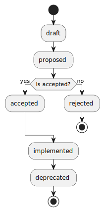

# Requests for Comments (RFCs)

> NOTE: This repository is a template for Git repositories that are used to manage Requests for Comments (RFCs) for software projects. For more information, read the [accompanying blog post](https://kieranpotts.com/rfcs).

This repository is the home of the Requests for Comments (RFCs) process for [Project Name].

The primary purpose of this repository is to record architecturally-significant design choices, and to provide a mechanism by which those choices can be discussed and reviewed by the project's stakeholders. It is used also to record choices of coding standards, automation tools, branching-and-merging conventions, testing and release strategies, and other aspects of the development and operations life cycle.


## What is an RFC?

A Request for Comments (RFC) is a proposal for a _significant_ change to the system design or architecture, or to our development and operations life cycle processes (automated or otherwise).

Many changes, such as bug fixes and documentation improvements, can be implemented and subsequently reviewed via the normal merge request workflow. But some changes are substantial enough that it is beneficial to get early feedback and to build consensus among stakeholders on the solution design _before_ its implementation. This is the purpose of the RFC process.

Significant changes that require pre-approval via an RFC include, but are not limited to:

- Changes to the system architecture, or deviations from established patterns in the implementation of a new feature.
- Changes to the application's user interfaces – whether graphical, command-line or programmatic – or changes that otherwise will have downstream impacts.
- Changes that may impact the service level agreement, such as changes to the security model or new features that carry risks for performance and availability.
- Changes to development and operations life cycle processes, or anything that may impact how individual contributors do their work.
- Changes to the technology stack and dependencies.

The serialized RFC documents form a continuous, chronological log of all the major technical decisions made over the history of this project.

## Overview

Each RFC proposal has one of the following possible states, representing the stage that the proposal is at in the decision-making process:

- **Draft**: A preliminary version of a proposal, put forward for early feedback.
- **Proposed**: A proposal that is being negotiated with the relevant stakeholders.
- **Accepted**: A proposal that has been approved and is currently pending implementation.
- **Rejected**: A proposal that has been rejected and will not be taken forward.
- **Implemented**: A proposal that has been implemented and is currently in effect.
- **Deprecated**: A legacy proposal that was previously implemented but has since been superseded by more recent changes and is no longer in effect.

The RFC process is initialized by a proposal being put forward for comments – literally, a request for comments. There is one main document per proposal – a Markdown file – and each proposal is generally scoped to a single technical decision.

Proposals are negotiated with the relevant project stakeholders. During the RFC process, the original proposal may change, perhaps significantly, in response to stakeholder feedback. When the proposal is finalized, the original proposal document is be updated to describe the settled solution, the design rationale for it, and the relative pros and cons of any alternative solutions that were considered.

The outcome of the RFC process is for the finalized proposal to be either accepted or rejected.

When a proposal is accepted, it is queued for implementation. Tasks will be created in the relevant project management tools to track the implementation.

Once a proposal reaches the accepted or rejected state, the contents of the proposal document are treated as immutable. Only the status of the document may change thereafter. This constraint ensures that records of all past decisions – even those that are no longer in effect – are persisted indefinitely. To change past decisions, new RFCs are introduced that extend or supersede prior ones.

<!--
@startuml

start

:draft;
:proposed;

if (Is accepted?) then (yes)
  :accepted;
else (no)
  :rejected;
  stop
endif

:implemented;
:deprecated;

stop

@enduml
-->



## Contributing

Anyone can contribute to the technical direction of this project by submitting proposals and requesting comments on them.

To contribute, follow these steps:

1. External contributors must fork the RFC repository into another personal or organization account on GitHub. Users with write access to the reference repository may skip this step.

2. Branch off from `main` using the naming convention `proposal/[description]`, where `[description]` is a short hyphen-delimited slug describing the proposed change. For example, `proposal/git-for-version-control`.

3. Copy the `rfcs/TEMPLATE.md` file, renaming the copied file to `rfcs/[description].md`, matching `[description]` to the branch name.

4. Edit the document, fleshing out your thoughts in more detail, as best you can. RFCs should present a convincing motivation for the proposal, demonstrate an understanding of the impact of the proposed solution, and be honest about the drawbacks and relative merits of alternative solutions. You do not need to include all sections of the template; just include what is relevant to the problem and solution at hand. RFCs should be written in an informal style (they are not specifications or standards) and they may leave questions open for discussion. Other artifacts such as architectural diagrams may be linked from or embedded in the proposal documents.

5. Commit your changes and push them to the upstream reference repository. Open a pull request to merge your proposal into the `main` branch of the reference repository. Copy the title of your proposal document into the title of the PR, and write a short summary of the proposal in the PR's description field.

TIP: In the first instance, if you are unsure if your idea is even relevant to the project, you may instead open a _draft_ PR. Draft PRs will not be merged, but will be closed once the project maintainers have given an indication whether or not an idea is worth elaborating.

The project maintainers will review your proposal and provide feedback. If they agree the idea should be explored in more detail, they will open a discussion thread and request comments from other stakeholders. During the RFC process, you should be prepared to build consensus for your idea, and to revise your proposal in response to feedback.

Once discussion has resolved the main points of contention, and once the proposed solution has stabilized, the project maintainers will provisionally mark the proposal as "accepted" or "rejected" and invite final comments. The final comment period lasts for at least _____ weeks.

The outcome of the RFC process will be for your proposal document to be merged into the `main` branch of the upstream reference repository. All proposals (except drafts) are merged, whether they are ultimately accepted or rejected. On merging, the project maintainers will make final edits to your PR, giving the RFC a unique numerical ID and changing the document's status to `ACCEPTED` or `REJECTED`, depending on the final outcome.

When a proposal is accepted, it is said to be pending implementation, and the project maintainers will open tickets to track the implementation. Those tickets will be linked from the proposal document, and vice versa. Tasks will be prioritized and assigned to individual contributors in the normal way. The acceptance of an RFC is not approval to begin development. And it will not necessarily be the case that the author of the RFC will be the one who implements the required changes.

Finally, when the implementation is complete, the status of the document will be changed to `IMPLEMENTED`.

During development, the design of a solution may be further iterated from the original proposal. Therefore accepted proposals will continue to be edited by the project maintainers to reflect the evolving design. But once the implementation is done (which means, shipped to production), the contents of the RFC document will be updated to reflect the final design and will thereafter be treated as immutable.

To change or revert past decisions that have been already implemented, new proposals must be put forward that supersede the original ones. The status of the original decisions will be changed to `DEPRECATED` and the relevant documents will be updated to cross-reference each other.

```txt
Supersedes: RFC 0123
Superseded by: RFC 0321
```

## Contributor license agreement

By opening a pull request to this repository, you accept and agree to the following terms and conditions:

- You agree that your contribution may be distributed under the terms of the [Creative Commons Attribution 4.0 International License](https://creativecommons.org/licenses/by/4.0/).

- You certify that your contribution is either created in whole by you and you have the right to distribute the work under the designated license, or is based on a previous work with a similar license that permits distribution and modification under the designated license.

- You understand and agree that your contribution is public and that a record of the contribution, including all personal information that you submit with it, is maintained indefinitely and may be redistributed as per the requirements of the designated license.

## Acknowledgements

The concept of Requests for Comments originates from the IETF's RFC process, which is specified in [RFC 2026](https://www.rfc-editor.org/rfc/rfc2026.txt). The design of this RFC template has been influenced by [Ember's RFCs](https://github.com/emberjs/rfcs), [ESLint's RFCs](https://github.com/eslint/rfcs), [React's RFCs](https://github.com/reactjs/rfcs), [Rust's RFCs](https://rust-lang.github.io/rfcs/) and [Major Change Proposals](https://forge.rust-lang.org/compiler/mcp.html), [Vue's RFCs](https://github.com/vuejs/rfcs), [Yarn's RFCs](https://github.com/yarnpkg/rfcs), and [Architectural Decision Records (ADRs)](https://www.youtube.com/watch?v=rwfXkSjFhzc).

----

The contents of this repository have been released to the public domain by the copyright holders, as per the terms of the [Creative Commons Zero license](https://creativecommons.org/publicdomain/zero/1.0/deed.en).
